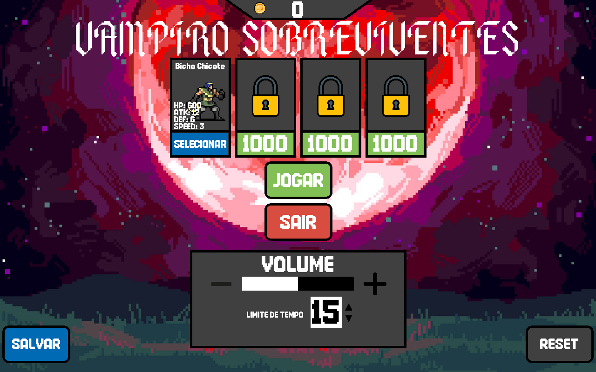
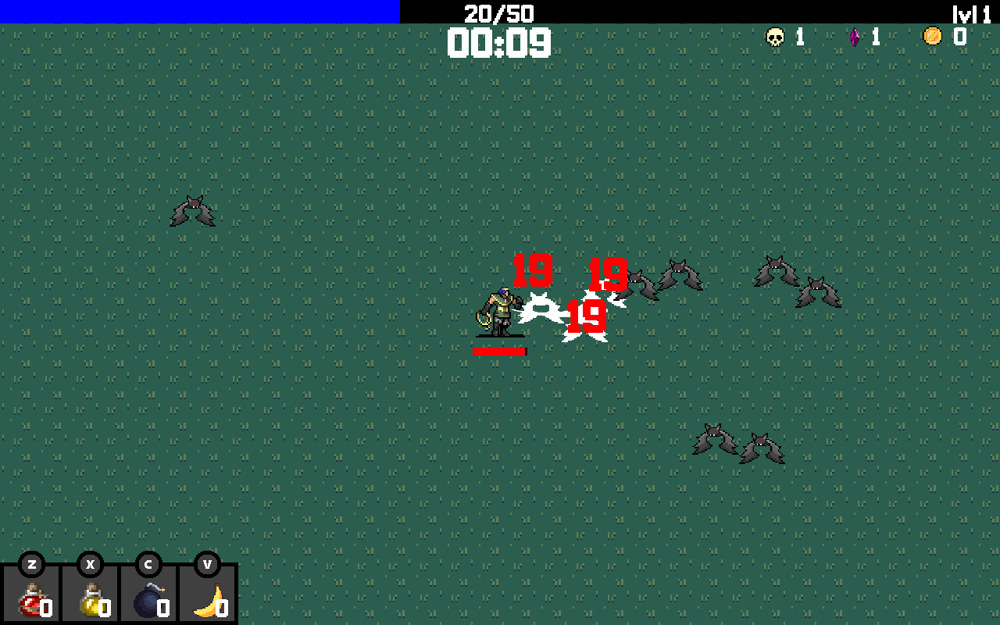
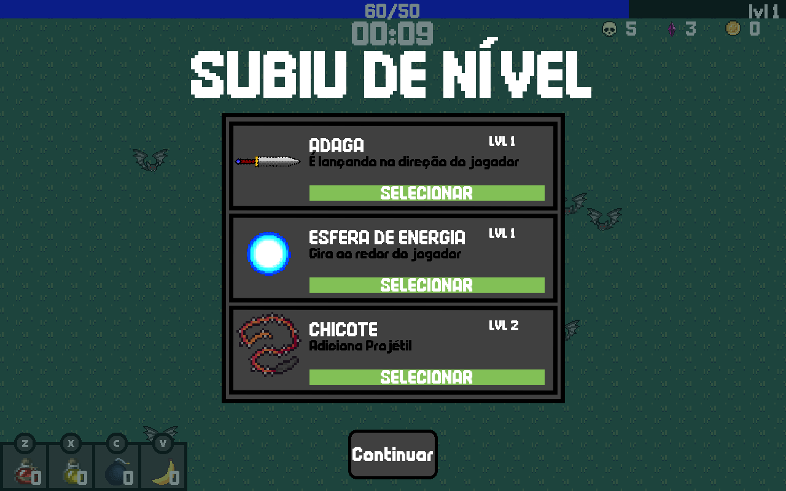
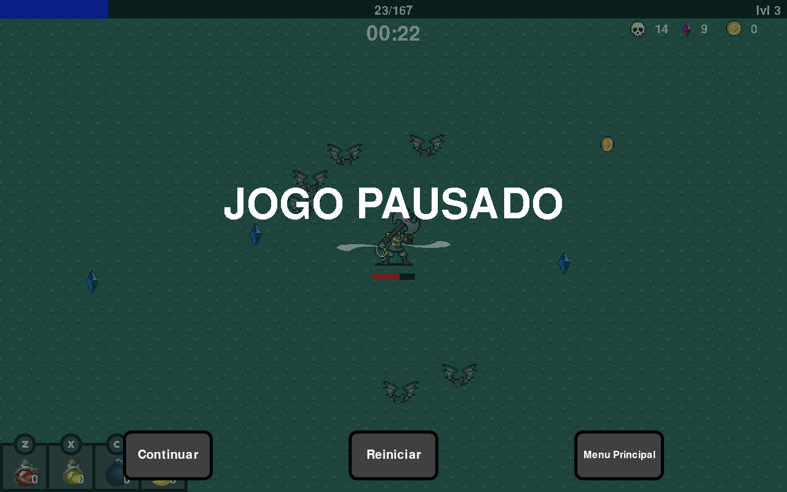
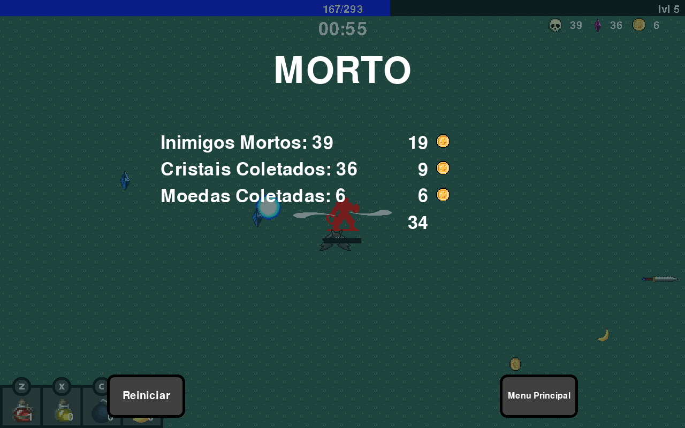

 # VAMPIRO SOBREVIVENTES - Projeto de IP1 - 2024.1 - Grupo 8 - CC

## Como usar o jogo
Baixe o projeto e rode o executável específico para o seu sistema operacional (Windows e Linux compatíveis).

Alternativamente, abra o main.py na sua IDE de escolha e rode. Certifique-se que o pygame está instalado.

### Controles
WASD ou setas - Controlam movimento do personagem

Z - Consome Poção de Cura

X - Consome Poção de Velocidade

C - Consome Bomba

V - Consome Banana de XP

ESC - Pausa o jogo

P - Tira screenshot

## Arquitetura do Projeto:
O jogo é separado em diversos arquivos, a ideia principal é que o "Game Loop" esteja localizado no arquivo main.py, onde chamamos todos os outros arquivos de objetos separados. Para cada **tipo** de objeto (coletável, ataque, inimigo, etc.), tem um arquivo separado, onde definimos sua classe, e utilizamos as classes para definir cada objeto do jogo e manipular seus dados no "Game Loop" de acordo com os nossos objetivos.

_EX:_ No arquivo **inimigos.py**, definimos TUDO que seja relacionado ao objeto Inimigos. A classe de inimigos, onde definimos os atributos dos inimigos como vida, dano, defesa. Definimos sua lógica, como é sua movimentação. Definimos sua animação, definimos o que ocorre quando o inimigo morre, definimos o que ocorre quando o inimgo entra em colisão com o jogador, o que ocorre quando entra em colisão com outro inimigo, etc.

Isso foi realizado para todo objeto que inserimos no jogo, criando uma estrutura de acesso simples, pois se você deseja acessar qualquer coisa que seja relacionada aos inimigos estará tudo contido dentro do arquivo respectivo, simplificando o entendimento e o nosso desenvolvimento. O principal motivo da utilização desse modelo de arquitetura de código foi para facilitar o nosso trabalho em equipe, por exemplo, se alguém estava trabalhando em refinar o sistema de colisão dos inimigos, tudo que era necessário modificar era o arquivo inimigos.py, e mais nada.

## Screenshots do jogo em execução:

## Ferramentas, Bibliotecas e Frameworks Utilizadas:

### Ferramentas:
Foi utilizado o PyInstaller para compilação do jogo em um arquivo executável, para uma execução simples em sistemas Windows e Linux.

### Bibliotecas:

O jogo foi desenvolvido na linguagem **Python**, com utilização principal do módulo **Pygame** para o seu desenvolvimento.
Também foram utilizados módulos complementares, adicionados para realizar funções específicas que não estavam disponíveis no Pygame

1: **sys** - Utilizado pela função sys.exit() cujo objetivo foi corrigir um problema que ocorria após a compilação em um arquivo .exe com o pyinstaller, onde o jogo não fechava corretamente.

2: **random** - Foi utilizando para geração aleatória de diversos recursos e dados, como o spawn de inimigos e recursos em localizações aleatórias ao redor do player.

3: **math** - Foi utilizado para utilização de funções matemáticas específicas, principalmente para encontrar o círculo ao redor do jogador, que é utilizado para geração do spawn de inimigos ao seu redor, bem como o ataque Esfera de Energia que gira ao redor da posição do jogador.

4: **pickle** - Foi adicionado para adicionar um sistema de save que mantém o registro de sua quantidade de moedas e personagens desbloqueados mesmo após fechar o jogo. O módulo pickle autoriza a utilização de um arquivo .pkl para acessar, armazenar e manipular esses dados.

5: **datetime** - Foi usado para acessar a data e hora do sistema, informção relevante para distinguir as screenshots tiradas durante o jogo.

### Frameworks:

Não foi utilizado frameworks para esse projeto.

## Divisão de Trabalho

> [!NOTE]
> _Um detalhe importante:_ A nossa estrutura para divisão de trabalho não foi uma de separar tarefas específicas para cada pessoa. A nossa estrutura era uma simples lista de tarefas que necessitavam ser completas, e quem queria concluir aquela tarefa escolhia e desenvolvia.

A SER COMPLETO

## Conceitos utilizados:
Conceitos básicos de Python
Condicionais (ifs - elses)
Laços de repetição (while - for)
Listas, Tuplas e Dicts para armazenar e manipular dados.
Programação orientada a objetos (OOP)

## Desafios durante o desenvolvimento
Inicialmente, a divisão de tarefas não foi ideal. Isso ocorreu por falta de comunicação entre todos os integrantes do grupo, que resultou em um desenvolvimento desigual no início do projeto, com poucas pessoas trabalhando em conjunto, que revela o principal desafio e o nosso maior erro, a falta de comunicação. A principal forma de lidar com esse problema foi criando uma base para a divisão de tarefas, e encorajando a todos a trabalharem em conjunto, comunicando quando possível se sente que X é bom ou que Y tem que melhorar, isso resultou em um desenvolvimento mais acelerado e melhorou nosso projeto final, autorizando a inclusão de features que nem imaginamos que seriam adicionadas no projeto.

## Lições aprendidas
O principal que aprendemos nesse projeto foi a grande importãncia de boa comunicação entre o grupo em um projeto de desenvolvimento como esse, que é absolutamente relevante a cada passo da discussão da ideia inicial até o desenvolvimento da ideia em si, a comunicação autoriza a você encontrar novas ideias, e ver os problemas a serem resolvidos por uma nova perspectiva. O simples comentário de "Será que tinha como modificar isso para fazer X?", "Isso podia ser melhor, pois causa problemas com Y", etc. Feedback entre o grupo (e fora do grupo) foi um grande motivo que o projeto seguiu esse ramo de desenvolvimento.
